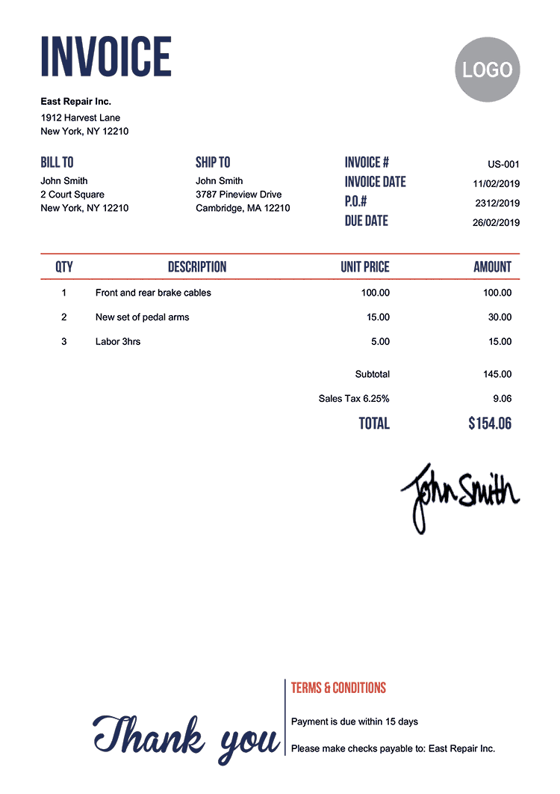
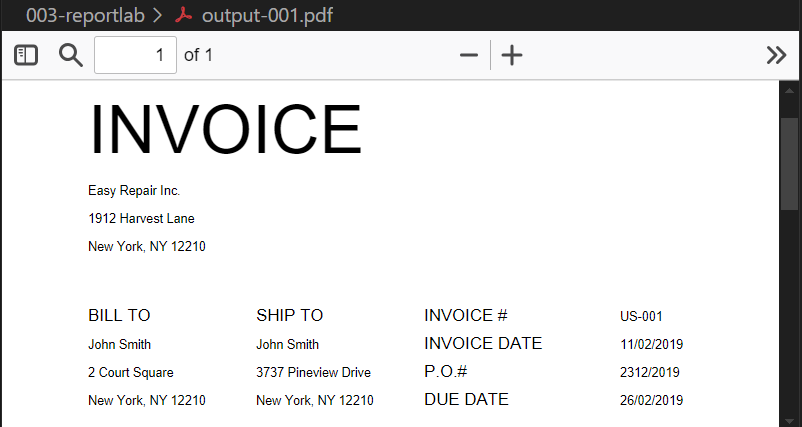
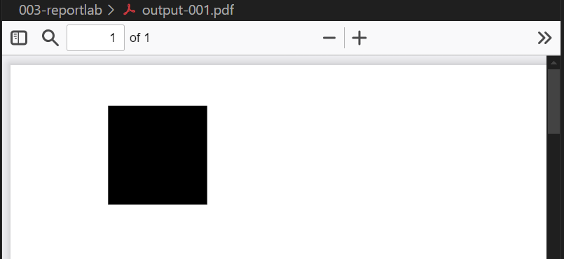
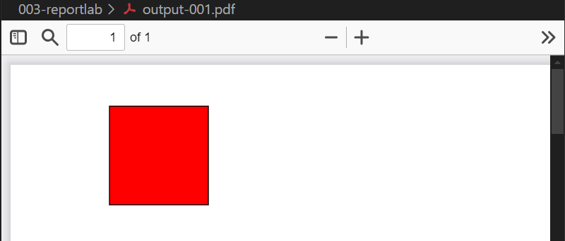
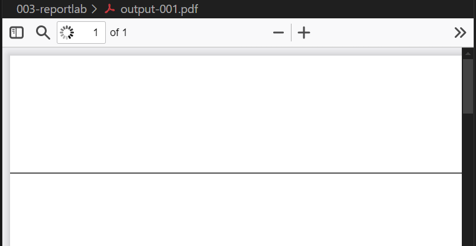
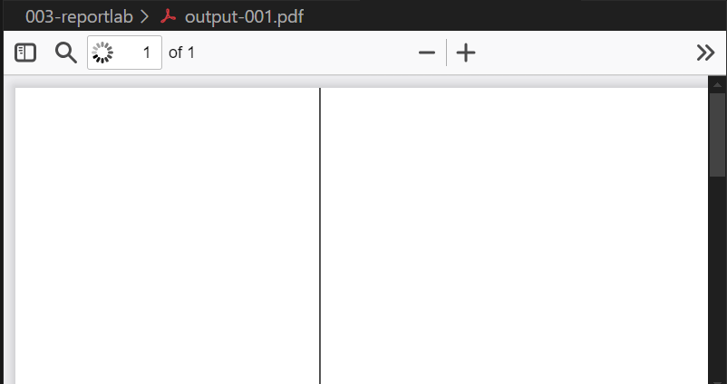
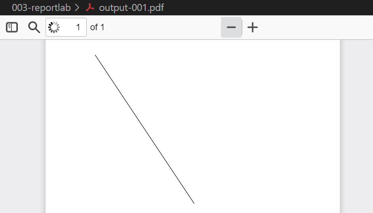

# Guide on reportlab
## 1. write a simple pdf and output
default canva size is 595 × 842
```python
from reportlab.pdfgen import canvas
c = canvas.Canvas("output-001.pdf")
c.drawString(100, 750, "Hello pdf!")
c.showPage()
c.save()
```


## 2. coordinate (x, y)
### a. increase x, is move to right
```python 
from reportlab.pdfgen import canvas
c = canvas.Canvas("output-001.pdf")
c.drawString(100, 750, "Hello pdf!")
c.drawString(200, 750, "Right!")
c.showPage()
c.save()
```

### b. decrease y, is move to down
```python
from reportlab.pdfgen import canvas
c = canvas.Canvas("output-001.pdf")
c.drawString(100, 750, "Hello pdf!")
c.drawString(100, 650, "Down!")
c.showPage()
c.save()
```


## 3. Set font type
```python
from reportlab.pdfgen import canvas
c = canvas.Canvas("output-001.pdf")
c.setFont("Times-Roman", 12)
c.drawString(100, 750, "Hello pdf!")
c.drawString(200, 750, "Right!")
c.drawString(100, 650, "Down!")
c.showPage()
c.save()
```


other fonts:
- Helvetica (default)
- Courier
- Symbol
- ZapfDingbats

## 4. Clone an invoice (Low Fidelity)
sample invoice



part of code
```python
from reportlab.pdfgen import canvas
c = canvas.Canvas("output-001.pdf")
y = 750

c.setFont("Helvetica", 48)
c.drawString(100, y, "INVOICE")

c.setFont("Helvetica", 9)  # change to smaller font
y -= 30  # move down 30 unit
c.drawString(100, y, "Easy Repair Inc.")

y -= 20
c.drawString(100, y, "1912 Harvest Lane")

y -= 20
c.drawString(100, y, "New York, NY 12210")

c.setFont("Helvetica", 12)  # change to bigger font
y -= 50
c.drawString(100, y, "BILL TO")

c.setFont("Helvetica", 9)
y -= 20
c.drawString(100, y, "John Smith")
y -= 20
c.drawString(100, y, "2 Court Square")
y -= 20
c.drawString(100, y, "New York, NY 12210")

y += 60  # move up again
c.setFont("Helvetica", 12)
c.drawString(220, y, "SHIP TO")  # move to right

c.setFont("Helvetica", 9)
y -= 20
c.drawString(220, y, "John Smith")
y -= 20
c.drawString(220, y, "3737 Pineview Drive")
y -= 20
c.drawString(220, y, "New York, NY 12210")

y += 60  # move up again
c.setFont("Helvetica", 12)
c.drawString(340, y, "INVOICE #")  # move to right
y -= 20
c.drawString(340, y, "INVOICE DATE")
y -= 20
c.drawString(340, y, "P.O.#")
y -= 20
c.drawString(340, y, "DUE DATE")

y += 60  # move up again
c.setFont("Helvetica", 9)

c.drawString(480, y, "US-001")  # move to right
y -= 20
c.drawString(480, y, "11/02/2019")
y -= 20
c.drawString(480, y, "2312/2019")
y -= 20
c.drawString(480, y, "26/02/2019")

c.showPage()
c.save()
```


## 5. Draw shapes
### a. rectangle
```python
from reportlab.pdfgen import canvas

c = canvas.Canvas("output-001.pdf")

# at coordinate (100, 700), size is 100 × 100
c.rect(100, 700, 100, 100, fill=1, stroke=1)

c.showPage()
c.save()
```



### b. change color
```python
from reportlab.pdfgen import canvas
from reportlab.lib.colors import red

c = canvas.Canvas("output-001.pdf")

c.setFillColor(red)
c.rect(100, 700, 100, 100, fill=1, stroke=1)

c.showPage()
c.save()
```



### c. line
a. horizontal line
```python
from reportlab.pdfgen import canvas
from reportlab.lib.colors import red

c = canvas.Canvas("output-001.pdf")

# c.line(x-start, y-start, x-end, y-end)
c.line(0, 700, 595, 700)

c.showPage()
c.save()
```



b. vertical line
```python
from reportlab.pdfgen import canvas
from reportlab.lib.colors import red

c = canvas.Canvas("output-001.pdf")

# c.line(x-start, y-start, x-end, y-end)
c.line(240, 842, 240, 0)

c.showPage()
c.save()
```



c. gradient line

```python
from reportlab.pdfgen import canvas
from reportlab.lib.colors import red

c = canvas.Canvas("output-001.pdf")

# c.line(x-start, y-start, x-end, y-end)
c.line(100, 800, 300, 500)

c.showPage()
c.save()
```

