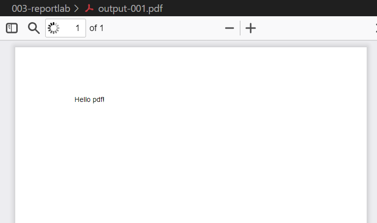
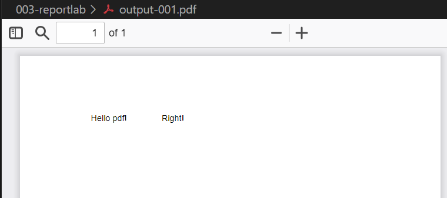
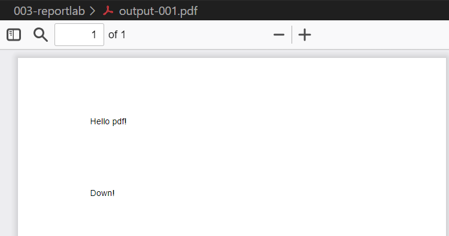
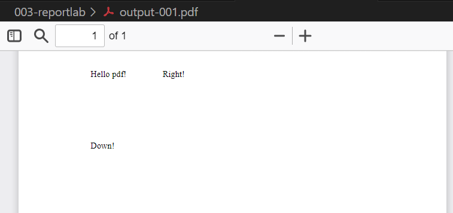

# Guide on reportlab
## 1. write a simple pdf and output
```python
from reportlab.pdfgen import canvas
c = canvas.Canvas("output-001.pdf")
c.drawString(100, 750, "Hello pdf!")
c.showPage()
c.save()
```


## 2. coordinate (x, y)
### a. increase x, is move to right
```python 
from reportlab.pdfgen import canvas
c = canvas.Canvas("output-001.pdf")
c.drawString(100, 750, "Hello pdf!")
c.drawString(200, 750, "Right!")
c.showPage()
c.save()
```

### b. decrease y, is move to down
```python
from reportlab.pdfgen import canvas
c = canvas.Canvas("output-001.pdf")
c.drawString(100, 750, "Hello pdf!")
c.drawString(100, 650, "Down!")
c.showPage()
c.save()
```


## 3. Set font type
```python
from reportlab.pdfgen import canvas
c = canvas.Canvas("output-001.pdf")
c.setFont("Times-Roman", 12)
c.drawString(100, 750, "Hello pdf!")
c.drawString(200, 750, "Right!")
c.drawString(100, 650, "Down!")
c.showPage()
c.save()
```


other fonts:
- Helvetica (default)
- Courier
- Symbol
- ZapfDingbats

## 4. Draw shapes